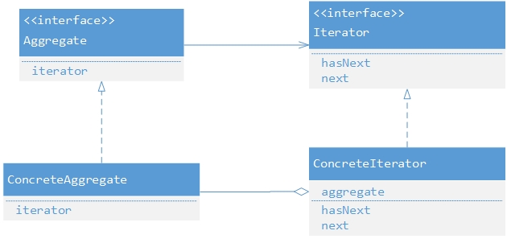
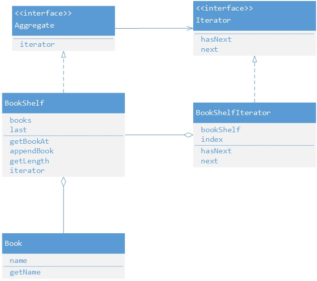

## Iterator模式
Iterator是一个非常常见的设计模式，比如java中常用的Hashmap的Iterator。

### 目标：
使用Iterator模式模拟书和书架的关系，将所有书放入书架中后，打印书架中每本书的名字。  
### 抽象角色：
Aggregate：接口，定义创建Iterator接口。  
ConcreteAggregate：Aggregate接口的具体实现，由该类创建对应的迭代器。  
Iterator：接口，定义迭代器的方法。  
ConcreteIterator：Iterator接口的具体实现，用于遍历集合。  
### 抽象UML图：

### 思路：
根据两个接口间的关系，可以理解为Iterator负责实现遍历的具体方法，而Aggregate负责创建一个用来遍历自身内部集合的Iterator，并为Iterator的遍历提供支持。
### 实例角色：
Book：表示书籍的类。  
Aggregate：接口，定义创建Iterator接口。  
BookShelf：Aggregate接口的具体实现，表示用来放书的书架。  
Iterator：接口，定义迭代器的方法。  
BookShelfIterator：Iterator接口的具体实现，可以查找/遍历书籍。  
### 实例UML图：

